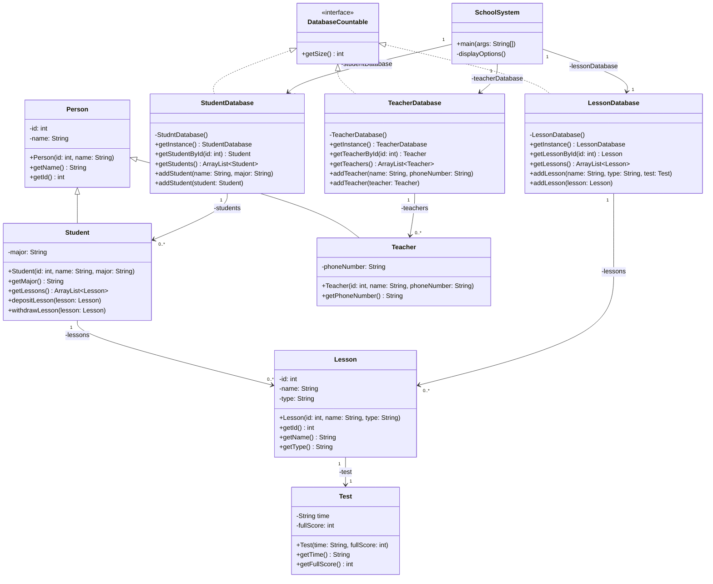

# 东北大学软件学院2021级Java辅学

___请用Typora或其他支持mermaid图表格式的MD编辑器打开___

```mermaid
classDiagram
    class Person{
        -id: int
        -name: String
        +Person(id: int, name: String)
        +getName() String
        +getId() int
    }
    class Student{
        -major: String
        +Student(id: int, name: String, major: String)
        +getMajor() String
        +getLessons() ArrayList~Lesson~
        +depositLesson(lesson: Lesson)
        +withdrawLesson(lesson: Lesson)
    }
    class Teacher{
        -phoneNumber: String
        +Teacher(id: int, name: String, phoneNumber: String)
        +getPhoneNumber() String
    }
    class Lesson{
        -id: int
        -name: String
        -type: String
        +Lesson(id: int, name: String, type: String)
        +getId() int
        +getName() String
        +getType() String
    }
    class Test{
        -String time
        -fullScore: int
        +Test(time: String, fullScore: int)
        +getTime() String
        +getFullScore() int
    }
    class LessonDatabase{
        -LessonDatabase()
        +getInstance() LessonDatabase
        +getLessonById(id: int) Lesson
        +getLessons() ArrayList~Lesson~
        +addLesson(name: String, type: String, test: Test)
        +addLesson(lesson: Lesson)
    }
    class StudentDatabase{
        -StudntDatabase()
        +getInstance() StudentDatabase
        +getStudentById(id: int) Student
        +getStudents() ArrayList~Student~
        +addStudent(name: String, major: String)
        +addStudent(student: Student)
    }
    class TeacherDatabase{
        -TeacherDatabase()
        +getInstance() TeacherDatabase
        +getTeacherById(id: int) Teacher
        +getTeachers() ArrayList~Teacher~
        +addTeacher(name: String, phoneNumber: String)
        +addTeacher(teacher: Teacher)
    }
    class DatabaseCountable{
        <<interface>>
        +getSize() int
    }
    class SchoolSystem{
        +main(args: String[])
        -displayOptions()
    }
    
    Person <|-- Student
    Person <|-- Teacher
    
    DatabaseCountable <|.. LessonDatabase
    DatabaseCountable <|.. TeacherDatabase
    DatabaseCountable <|.. StudentDatabase
    
    Lesson "1" --> "1" Test: -test
    
    Student "1" --> "0..*" Lesson: -lessons
    
    LessonDatabase "1" --> "0..*" Lesson: -lessons
    
    StudentDatabase "1" --> "0..*" Student: -students
    
    TeacherDatabase "1" --> "0..*" Teacher: -teachers
    
    SchoolSystem "1" --> "1" LessonDatabase: -lessonDatabase
    SchoolSystem "1" --> "1" TeacherDatabase: -teacherDatabase
    SchoolSystem "1" --> "1" StudentDatabase: -studentDatabase
    
    
```

