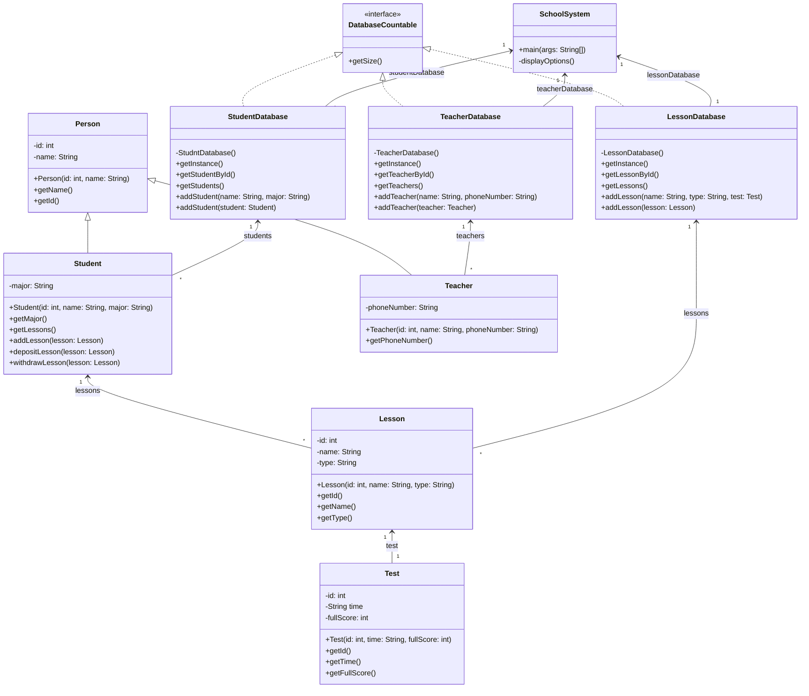

# 东大2021级Java辅学

___请用Typora或其他支持mermaid图表格式的MD编辑器打开___

```mermaid
classDiagram
    class Person{
        -id: int
        -name: String
        +Person(id: int, name: String)
        +getName()
        +getId()
    }
    class Student{
        -major: String
        +Student(id: int, name: String, major: String)
        +getMajor()
        +getLessons()
        +addLesson(lesson: Lesson)
        +depositLesson(lesson: Lesson)
        +withdrawLesson(lesson: Lesson)
    }
    class Teacher{
        -phoneNumber: String
        +Teacher(id: int, name: String, phoneNumber: String)
        +getPhoneNumber()
    }
    class Lesson{
        -id: int
        -name: String
        -type: String
        +Lesson(id: int, name: String, type: String)
        +getId()
        +getName()
        +getType()
    }
    class Test{
        -id: int
        -String time
        -fullScore: int
        +Test(id: int, time: String, fullScore: int)
        +getId()
        +getTime()
        +getFullScore()
    }
    class LessonDatabase{
        -LessonDatabase()
        +getInstance()
        +getLessonById()
        +getLessons()
        +addLesson(name: String, type: String, test: Test)
        +addLesson(lesson: Lesson)
    }
    class StudentDatabase{
        -StudntDatabase()
        +getInstance()
        +getStudentById()
        +getStudents()
        +addStudent(name: String, major: String)
        +addStudent(student: Student)
    }
    class TeacherDatabase{
        -TeacherDatabase()
        +getInstance()
        +getTeacherById()
        +getTeachers()
        +addTeacher(name: String, phoneNumber: String)
        +addTeacher(teacher: Teacher)
    }
    class DatabaseCountable{
        <<interface>>
        +getSize()
    }
    class SchoolSystem{
        +main(args: String[])
        -displayOptions()
    }
    
    Person <|-- Student
    Person <|-- Teacher
    
    DatabaseCountable <|.. LessonDatabase
    DatabaseCountable <|.. TeacherDatabase
    DatabaseCountable <|.. StudentDatabase
    
    Lesson "1" <-- "1" Test: test
    
    Student "1" <-- "*" Lesson: lessons
    
    LessonDatabase "1" <-- "*" Lesson: lessons
    
    StudentDatabase "1" <-- "*" Student: students
    
    TeacherDatabase "1" <-- "*" Teacher: teachers
    
    SchoolSystem "1" <-- "1" LessonDatabase: lessonDatabase
    SchoolSystem "1" <-- "1" TeacherDatabase: teacherDatabase
    SchoolSystem "1" <-- "1" StudentDatabase: studentDatabase
    
    
```

